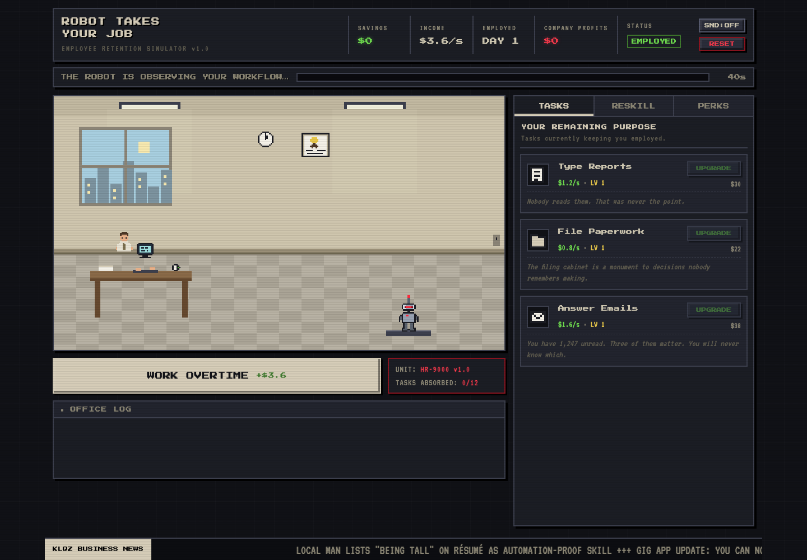

# ROBOT TAKES YOUR JOB

A darkly comic pixel-art idle game about staying employed while an
ever-improving office robot learns to do everything you do.



You start as a Data Entry Clerk. HR-9000 starts as a "productivity
companion." One by one it learns your tasks — each one it absorbs is
**gone forever**, and your income drops. Reskill into ever-more-niche
professions (rideshare driver → artisanal pickle sommelier → human
captcha) and stay one lesson ahead of the machine.

The one win condition: become the **Robot Therapist**. It took every
job in the building, and it feels terrible about it. Listening to a
machine complain about its job is the last profession it can never
automate.

## Run it

No build step or runtime packages required. Either:

- open `index.html` directly in a browser, or
- `python3 -m http.server` in this folder and visit `http://localhost:8000`

Built with vanilla JavaScript, HTML, CSS, Canvas 2D, and Web Audio.
The game works without an account or backend. Google Fonts provides the
typefaces; system monospace fonts are used when offline.

## Engineering highlights

- Separate game rules, content, DOM interface, canvas rendering, and audio modules.
- Code-generated pixel sprites and a changing office scene driven by automation progress.
- Wall-clock simulation that handles delayed ticks across multiple game events.
- Local saves with validation, capped offline earnings, and recovery from unavailable storage.
- Responsive desktop and mobile layouts, keyboard overtime, and optional sound.
- Automated game-logic and Chromium browser tests, run by GitHub Actions on pushes and pull requests.

## Checks

Playing requires no installation. To run the development checks, use Node.js 24
and Python 3:

```sh
npm ci
npx playwright install chromium
npm run check
```

`npm test` runs the 13 game-logic tests. `npm run test:browser` runs the
browser scenarios at desktop and mobile viewport sizes, including controls,
layout, saving, offline return, restart, and victory.

## How to play

- **Tasks earn money automatically**, even while the tab is closed
  (offline earnings are credited on return, capped at 8 hours).
- Gameplay pauses while a dialog is open, including orientation and reset confirmation.
- **WORK OVERTIME** (button, spacebar, or click the office) for a
  burst of cash worth one second of income.
- The threat bar shows what the Robot is currently learning and how
  long you have. When it finishes, that task is gone.
- **RESKILL** tab: buy new tasks. Higher tiers unlock as more of your
  work is automated — desperation is a prerequisite.
- **PERKS** tab: income multipliers, discounts, and two acts of
  sabotage (call the union rep, spill coffee on the Robot).
- Hit zero tasks and HR puts you on a **Performance Improvement
  Plan**: find a new task before the timer expires or you're
  made redundant. Days survived is your score.

## Structure

| File | Role |
|---|---|
| `js/data.js` | All content: 13 tasks across 4 tiers, 8 perks, every joke, and the balance knobs (`BALANCE`) |
| `js/game.js` | Pure game logic — income tick, robot learning, PIP, save/load/offline. No DOM. |
| `js/render.js` | Canvas renderer — sprites are code-generated from string grids, no image assets |
| `js/ui.js` | DOM layer — tabs, shop, toasts, log, ticker, modals |
| `js/sfx.js` | WebAudio chiptune beeper (muted by default, `SND` button toggles) |
| `js/main.js` | Boot, logic clock, autosave |

Save state lives in `localStorage` (`rtyj_save_v1`); the RESET button
wipes it. As automation spreads, watch the office: chrome floor tiles
creep in from the right, the motivational poster gets replaced, the
skyline turns red, and the Robot's trophy shelf fills with the icons
of everything you used to do.
